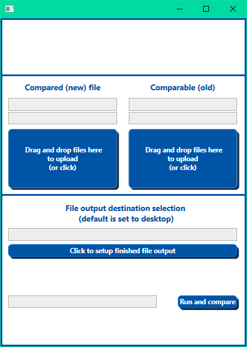
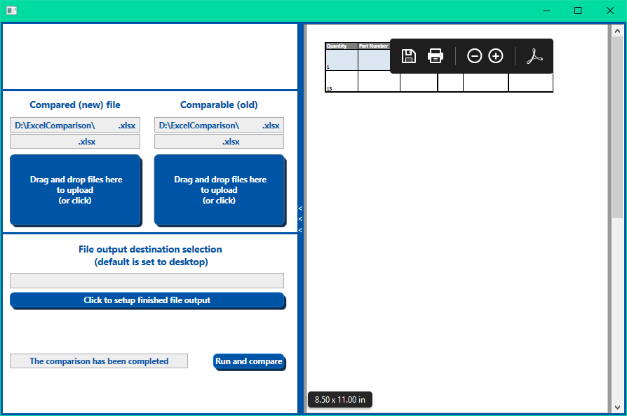
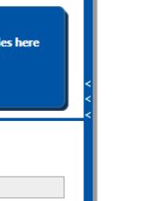
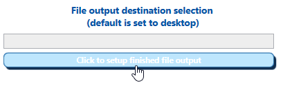
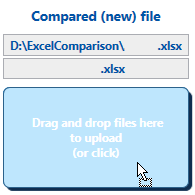

# ExcelComparison

Compares two excel files, gets differences and displays if wanted in the app screen, then also makes a new Excel .xlsx and a .pdf file with the results.

First thing you see after opening the program:

  
  
Program view after the "Run and compare" click:

Extra feature to minimize show/hide the in-app results, the choice is then saved through multiple program executes:

Reactive buttons on mouse hover, that's a basic function however the point of them will be explained with the next picture:

A custom drag and drop button that also works as a file explorer button, made to look exactly as a simple button. A custom hover script has been written for the button.

